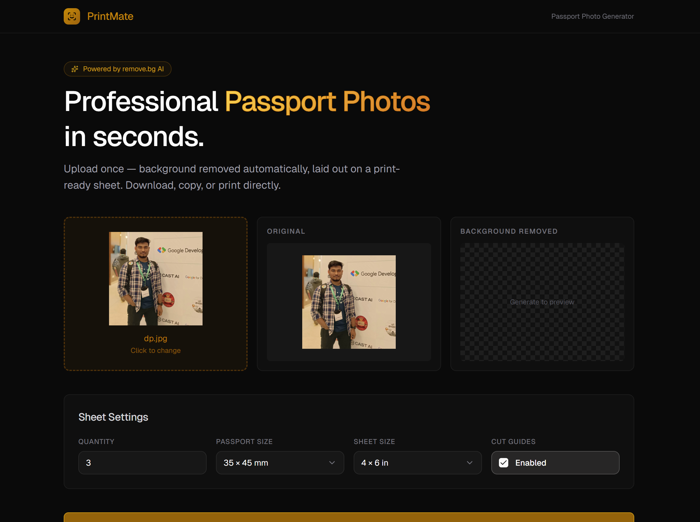

# PrintSyte

> Professional passport photos in seconds — background removed automatically, laid out on a print-ready sheet.



---

## What it does

PrintSyte takes a regular portrait photo, strips the background via the **remove.bg API**, and tiles the result onto a print-ready sheet at true **300 DPI**. The generated sheet can be downloaded as a PNG, copied to the clipboard, or sent straight to the printer — all in the browser, no backend required.

---

## Features

| Feature | Details |
|---|---|
| **Background removal** | Powered by [remove.bg](https://www.remove.bg) — one API call, instant result |
| **Face-aware crop** | Uses the browser's `FaceDetector` API (where supported) to centre the subject; falls back to a sensible default |
| **Passport size presets** | 35 × 45 mm (international) · 51 × 51 mm (US 2×2 in) |
| **Sheet size presets** | 4 × 6 in · 5 × 7 in · A4 |
| **Quantity control** | 1 – 20 photos per sheet, auto-wrapped into rows and columns |
| **Cut guides** | Optional crop marks drawn on the sheet |
| **Download** | Exports the sheet as a full-resolution PNG |
| **Copy** | Copies the sheet image to the system clipboard |
| **Print** | Opens a correctly sized `@page` print dialog with the sheet pre-loaded |
| **Drag & drop** | Drop a JPG or PNG directly onto the upload zone |

---

## Tech Stack

| Layer | Choice |
|---|---|
| Framework | [Next.js 16](https://nextjs.org) (App Router, Turbopack) |
| Language | TypeScript 5 |
| Styling | Tailwind CSS v4 |
| UI Components | [shadcn/ui](https://ui.shadcn.com) (Select, Input, Checkbox) + [Radix UI](https://www.radix-ui.com) |
| Icons | [Lucide React](https://lucide.dev) |
| API | [remove.bg](https://www.remove.bg/api) REST API |
| Fonts | Geist (via Next.js) |

---

## Project Structure

```
print-syte/
├── app/
│   ├── globals.css          # Design tokens + global utility classes
│   ├── layout.tsx           # Root layout (dark theme, Geist font)
│   └── page.tsx             # Entry page
│
├── components/
│   ├── passport-photo-generator.tsx   # Root orchestrator — all shared state & canvas logic
│   ├── photo/
│   │   ├── app-header.tsx             # Sticky top bar
│   │   ├── app-footer.tsx             # Footer with attribution
│   │   ├── hero-section.tsx           # Headline + description
│   │   ├── upload-zone.tsx            # Drag-and-drop file picker
│   │   ├── preview-card.tsx           # Original / background-removed previews
│   │   ├── sheet-settings.tsx         # Qty, size, sheet & guides controls
│   │   └── sheet-preview.tsx          # Canvas display + action buttons
│   └── ui/                            # shadcn components (Button, Input, Select, Checkbox…)
│
└── lib/
    ├── photo-utils.ts       # Constants, types, pure functions, remove.bg API call
    └── utils.ts             # cn() helper (clsx + tailwind-merge)
```

---

## Getting Started

### 1. Clone & install

```bash
git clone https://github.com/your-username/print-syte.git
cd print-syte
npm install
```

### 2. Add your remove.bg API key

Create a `.env.local` file in the project root:

```env
REMOVE_BG_API_KEY=your_api_key_here
```

Get a free API key at [remove.bg/api](https://www.remove.bg/api) — the free tier includes 50 API calls/month.

### 3. Run the dev server

```bash
npm run dev
```

Open [http://localhost:3000](http://localhost:3000).

---

## Available Scripts

| Command | Description |
|---|---|
| `npm run dev` | Start dev server with Turbopack |
| `npm run build` | Production build |
| `npm run start` | Serve the production build |
| `npm run typecheck` | Run TypeScript type checking |
| `npm run lint` | Lint with ESLint |
| `npm run format` | Format all `.ts` / `.tsx` files with Prettier |

---

## How it works

```
User uploads photo
       │
       ▼
remove.bg API  ──►  Background-removed PNG blob
       │
       ▼
FaceDetector API  ──►  Face centre coordinates (optional)
       │
       ▼
calculateCropRect()  ──►  Smart crop rectangle
       │
       ▼
chooseWrapLayout()  ──►  Grid cols × rows
       │
       ▼
HTML Canvas (300 DPI)  ──►  Tiled passport sheet
       │
       ├──► Download PNG
       ├──► Copy to clipboard
       └──► Print via popup window
```

---

## Environment Variables

| Variable | Required | Description |
|---|---|---|
| `REMOVE_BG_API_KEY` | ✅ | Your [remove.bg](https://www.remove.bg/api) API key |

---

## Browser Compatibility

- **Face detection** uses the experimental `FaceDetector` API (Chrome/Edge on desktop). On unsupported browsers the crop defaults to vertically centred at 45% of image height — still suitable for passport photos.
- **Clipboard image copy** requires a secure context (HTTPS or localhost) and the `ClipboardItem` API. A data-URL text fallback is used where it isn't available.

---

## License

MIT — see [LICENSE](./LICENSE) for details.
